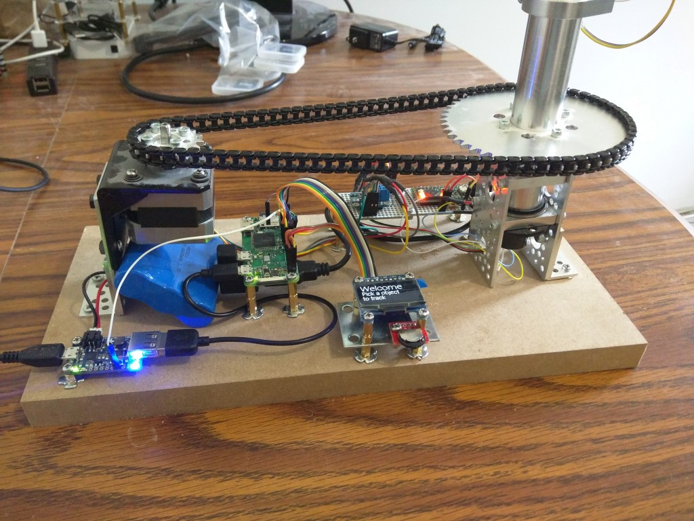
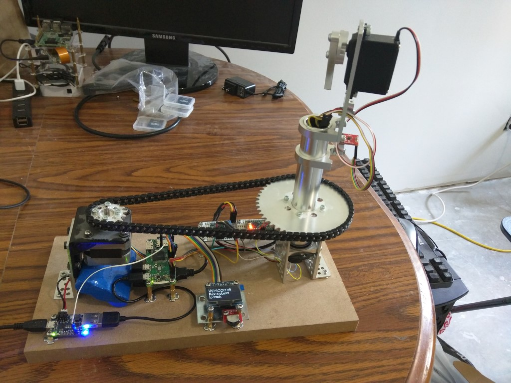
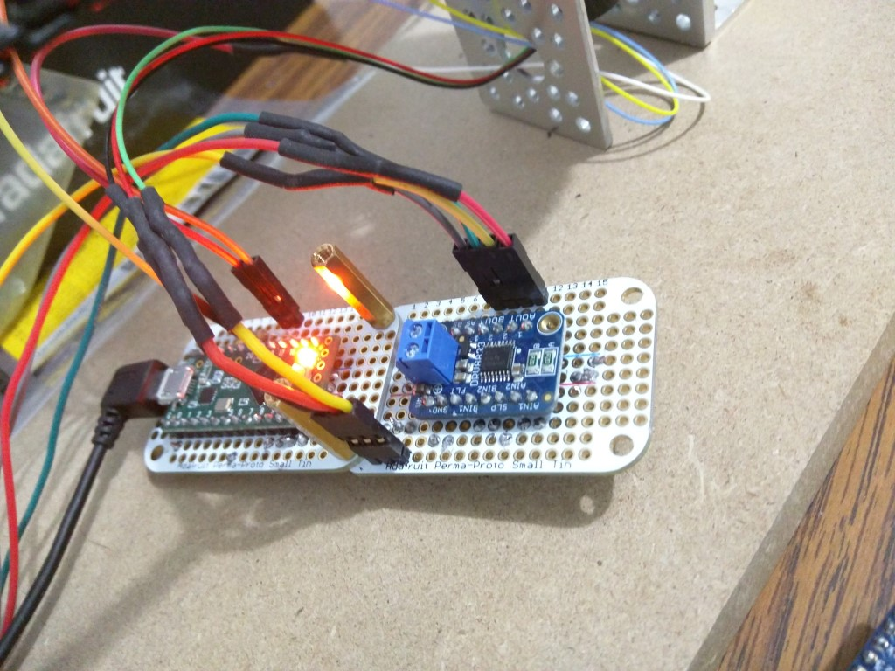
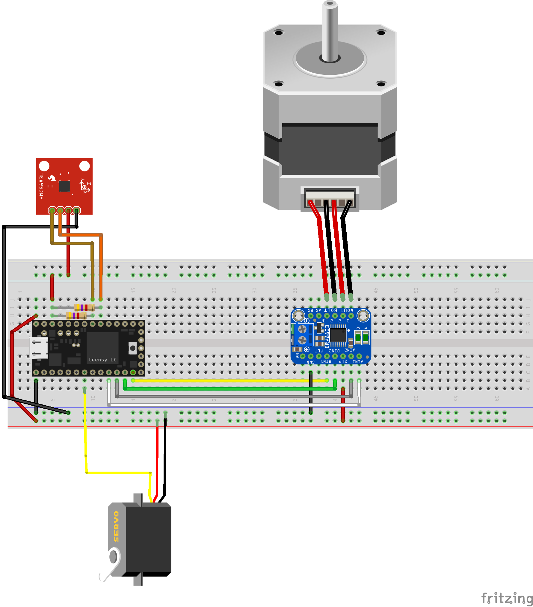

# SpacePointer
Find things in space and point to it.

This project was inspired by https://github.com/gradyh/ISS-Tracking-Pointer.

I wanted to expand it to point at more things then just the ISS and make it easy to use. It uses a compass so there is no need to align the pointer, just set it down and start using it.

[Skyfield](http://rhodesmill.org/skyfield/) is a python package that does all the math for the pointer.

## Video
[](https://www.youtube.com/watch?v=GbH-HHHjZxY)

## Images







## How to install.

1. Setup your Raspberry Pi and connect it to your Wi-Fi.
   * this has to be done at least once. But the data for the space station and other satellites needs to be updated often.
1. Enable the SPI and GPIO on the Raspberry Pi.
1. Make sure its up to date.
    1. ```sudo apt-get update```
    1. ```sudo apt-get upgrade```
1. Give the Pi a reboot here.
    1. ```sudo reboot```
1. Install python dev.
    1. ```sudo apt-get install python-dev```
    1. ```sudo python setup.py install```
1. Install python GPIO.
    1. ```sudo apt-get install python-rpi.gpio```
1. Install skyfield. It does all the space math for us.
    1. ```pip install skyfield```
1. Install Adafruit library for the display.
    1. ```git clone https://github.com/adafruit/Adafruit_Python_SSD1306.git```
    1. ```cd Adafruit_Python_SSD1306/```
    1. ```sudo python setup.py install```
    1. ```cd ..```
1. Clone this repo.
    1. ```git clone https://github.com/blee1170/SpacePointer.git```
1. Program the Arduino.
    1. The declination will need to be configured for your location. Use http://magnetic-declination.com/ to find it. Update it on line 130 in the Arduino code.
    1. Compass offset will also need to be set. I used this Arduino code to find it: https://github.com/jarzebski/Arduino-HMC5883L/tree/master/HMC5883L_calibrate
    1. I did not setup the Raspberry Pi to program the Arduino, I used another computer because of the steps above.
    1. Once the calibration offset and declination is set, you can write it to the Arduino.
1. Configure settings.
    1. Update your latitude and longitude in the ```RaspberryPi/config.py``` file.
    1. Also set what port and speed the Arduino will be listening on. (The defaults should be okay, unless you are using a USB hub or something).
1. Have the pointer start on startup.
    1. Copy the systemd service file to /usr/lib/systemd/system/.
    1. ```sudo cp RaspberryPi/spacePointer.service /usr/lib/systemd/system/```
    1. Enable the service.
    1. ```sudo systemctl enable spacePointer```
1. If you are using the adafruit powerboost you will want to enable the battery watcher service.
    1. Copy the service file and timer to /usr/lib/systemd/system/.
    1. ```sudo cp RaspberryPi/spacePointerBattery.* /usr/lib/systemd/system/```
    1. Enable the timer.
    1. ```sudo systemctl enable spacePointerBattery.timer```
    1. Ensure the script is runable.
    1. ```chmod +x lowBattery.sh```

---
### Parts list
* [Teensy-lc](https://www.pjrc.com/teensy/teensyLC.html) - Low cost Arduino.
* [Raspberry Pi Zero W](https://www.raspberrypi.org/products/pi-zero-w/) - Computer to do the stuff.
* [Stepper motor driver](https://www.adafruit.com/product/3297) - Control the thing that moves.
* [Stepper motor](https://www.adafruit.com/product/324) - The thing that moves.
* [Servo](https://www.adafruit.com/product/155) - Moves the other thing.
* [Display](https://www.adafruit.com/product/938) - So you know what's its pointing at.
* [Selector Switch](https://www.sparkfun.com/products/retired/8236) - Sorry, its retired.
* [Power Module](https://www.adafruit.com/product/2465) - Battery power is awesome.
* [Battery](https://www.adafruit.com/product/353) - Poooooower.

### Actobotics Parts
* [Angle Bracket](https://www.servocity.com/90-single-angle-short-channel-bracket) x2
* [Flat Dual Bracket](https://www.servocity.com/flat-dual-channel-bracket) x3
* [Tube](https://www.servocity.com/1-00-aluminum-tubing) x1 6"
* [Tube Clamp](https://www.servocity.com/1-bore-bottom-tapped-clamping-mounts) x2
* [Tube Spacer](https://www.servocity.com/shafting-and-tubing-spacers) x1 (Its a 12 pack)
* [Big Gear](https://www.servocity.com/1-50-aluminum-hub-mount-sprockets-0-250-pitch) x1 48T
* [Clamping Hub](https://www.servocity.com/1-bore-clamping-hub-a) x1
* [Small Gear](https://www.servocity.com/0-770-aluminum-hub-mount-sprockets-0-250-pitch) x1 16T
* [Plastic Chain](https://www.servocity.com/plastic-chain-0-250) x2
* [Screw Hub](https://www.servocity.com/770-set-screw-hubs) x1
* [Server Mount](https://www.servocity.com/standard-servo-plate-c) x1
* [Pillow Block](https://www.servocity.com/1-000-bore-quad-pillow-block) x2
* [Stepper Motor Mount](https://www.adafruit.com/product/1297) x1 (Had to be modified to attach to the bracket)

---
## Hardware wiring


The Teensy-LC was used because it can do both 5v and 3v outputs. The magnetometer can only do 3 volts, but the stepper driver needed 5. This was a great board for only $10.


The Raspberry Pi is wired up to display what is being tracked. I used [this](https://learn.adafruit.com/ssd1306-oled-displays-with-raspberry-pi-and-beaglebone-black/wiring) from Adafruit.

---
### Things I would like to add
1. Bluetooth interface. So you can use your phone to control it.

---
### Code used
* [Inspiration](https://github.com/gradyh/ISS-Tracking-Pointer)
* [Compass](https://github.com/jarzebski/Arduino-HMC5883L)
* [Display](https://github.com/adafruit/Adafruit_Python_SSD1306)
* [Low Battery Shutdown](https://github.com/NeonHorizon/lipopi)
* [Skyfield](http://rhodesmill.org/skyfield/)
